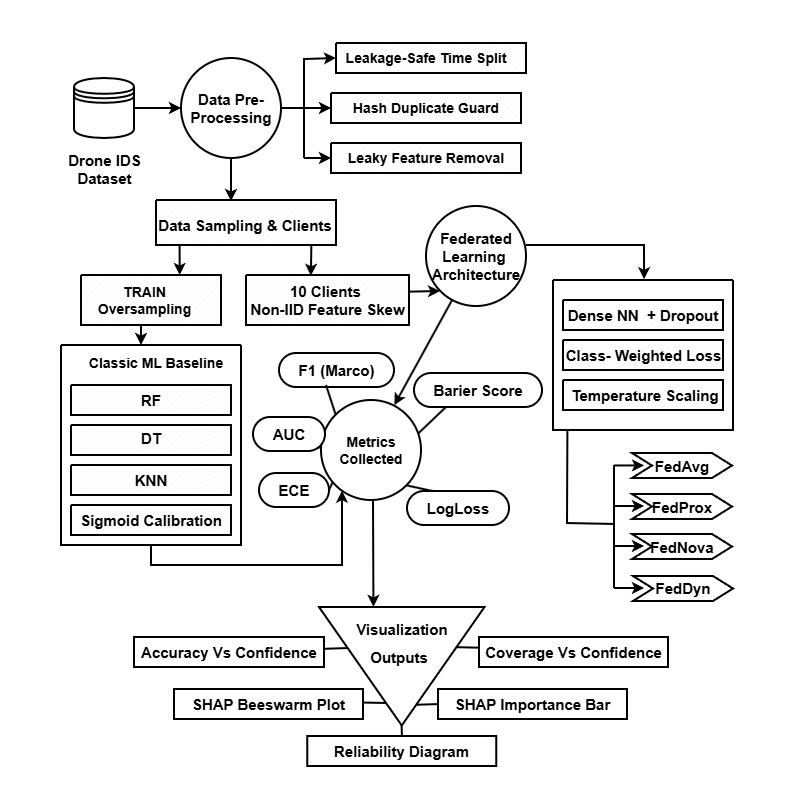

# Uncertainty-Aware Drone Intrusion Detection in Federated Learning
Uncertainty-Aware Drone IDS using Calibrated Federated Learning. Features leakage-safe chronological splitting, duplicate hashing, and multi-algorithm optimization for robust, non-IID intrusion detection.

[](https://colab.research.google.com/github/tankim-prio/Uncertainty-Aware-Drone-IDS/blob/main/code/drone_ids_experiments.ipynb)
[](https://www.python.org/)
[](https://federated.withgoogle.com/)
[](https://www.tensorflow.org/)
[](https://scikit-learn.org/)
[](https://shap.readthedocs.io/en/latest/)

Welcome to the official repository for research on securing decentralized drone swarms. 

Unmanned aerial swarms require continuous network connectivity to maintain cooperative flight behaviors safely. Hostile interference triggers cascading failures across these missions. However, centralizing their sensitive telemetry data for intrusion detection introduces severe privacy risks and bandwidth bottlenecks. This project bridges the gap between theoretical machine learning and deployable cybersecurity by engineering an **Uncertainty-Aware Federated Learning Intrusion Detection System (IDS)** that trains collaboratively across drones—without ever sharing raw data.

---

## Core Tech Stack & Libraries
This project leverages state-of-the-art frameworks to achieve federated convergence, probability calibration, and academic-grade reproducibility:
* **[Federated Learning Architecture](https://federated.withgoogle.com/):** Custom decentralized topology simulating 10-client non-IID feature skew, evaluating `FedAvg`, `FedProx`, `FedNova`, and `FedDyn`.
* **[TensorFlow / Keras](https://www.tensorflow.org/):** Powers the core local neural network architectures, utilizing dropout regularization and class-weighted binary cross-entropy.
* **[Scikit-Learn](https://scikit-learn.org/):** Drives the rigorous data engineering (`StratifiedShuffleSplit`, `StandardScaler`), classical baselines (`RandomForestClassifier`, `KNeighborsClassifier`), and mathematical post-hoc calibration (`CalibratedClassifierCV`).
* **[Matplotlib](https://matplotlib.org/):** Configured with strict paper-style defaults (serif fonts, PDF/PS fonttype 42) to generate publication-ready reliability diagrams and tradeoff curves.
* **[SHAP](https://shap.readthedocs.io/) & [LIME](https://github.com/marcotcr/lime):** Utilized for global and local Explainable AI (XAI) behavioral inspection.
* **[Pandas](https://pandas.pydata.org/) & [NumPy](https://numpy.org/):** Core data manipulation engines.

> **Reproducibility Guarantee:** All experiments enforce strict deterministic execution (`SEED = 42`) across Python, NumPy, and TensorFlow to guarantee 100% reproducibility for reviewers and researchers.

---

## 📖 Abstract
> Drone swarms used in critical infrastructure require intrusion detection without centralizing telemetry. Prior federated learning (FL)-based intrusion detection system (IDS) studies often report strong discrimination under evaluation leakage and ignore probability calibration, producing overconfident alerts under non-IID feature skew. We propose an uncertainty-aware drone intrusion detection system trained with federated learning and evaluated using leakage-safe chronological holdout splits, cross-split duplicate hashing, and feature hardening. We construct a 10-client non-IID feature-skew setting and train FedAvg, FedProx, FedNova, and FedDyn; operating points are selected via Youden's J statistic. We apply post-hoc temperature scaling and measure predictive performance using accuracy and Macro F1, and reliability using Expected Calibration Error (ECE), alongside SHAP for behavioral inspection. On the ISOT Drone Intrusion dataset, a centralized Random Forest provides an upper bound of Macro F1 = 0.9896. Under severe skew, FedAvg attains 98.60% accuracy and Macro F1 = 0.9844. Temperature scaling reduces ECE to 0.0026675, enabling selective alerting that defers low-confidence predictions to limit false alarms. Furthermore, explainability analyses reveal that while centralized models rely on rigid spatial identifiers such as ports, the federated architecture adapts to skew by shifting its defensive logic toward structural protocol anomalies such as DNS. Calibrated FL can deliver near-centralized UAV intrusion detection while supporting reliable human-in-the-loop deferral.

---

## System Architecture & Methodology
*This framework utilizes a leakage-safe chronological split, feature hardening, and post-hoc temperature scaling across a 10-client non-IID federated network.*



### The Core Engineering Pipeline
To prevent the overconfident alerts and temporal target leakage that inflate baseline metrics in traditional cybersecurity ML models, this architecture introduces several rigorous protocols:
1. **Leakage-Safe Evaluation:** Data is split strictly chronologically to maintain real-time causality. A cross-split duplicate hashing guard disables the memorization of overlapping packets between the training and testing phases. 
2. **Feature Hardening:** Over-predictive network artifacts are deliberately dropped, forcing the model to learn complex structural anomalies rather than memorizing easily spoofable shortcuts.
3. **Probability Calibration & Selective Alerting:** Uncalibrated deep neural networks are often dangerously confident about highly uncertain samples. By applying post-hoc temperature scaling, network confidence is mathematically aligned with actual empirical correctness rates. The system tunes decision thresholds via Youden's J statistic, safely deferring uncertain anomalies to human analysts and effectively reducing false alarm cascades.

---

## Repository Organization
This repository is streamlined into three core components for immediate evaluation by researchers and engineers:

* **[`data/`](./data):** Details on the original [ISOT Drone Anomaly Detection Dataset](https://onlineacademiccommunity.uvic.ca/isot/2024/12/05/drone-datasets/) and access instructions for the fully preprocessed, ML-ready `updated_drone_ids_dataset.csv`.
* **[`model/`](./model):** Contains the visual system architecture diagrams representing the federated topology and evaluation protocols.
* **[`code/`](./code):** The complete, reproducible Python codebase. The entire experiment is contained within a heavily documented Jupyter Notebook (`drone_ids_experiments.ipynb`) for immediate 1-click execution.

---

## Federated Ecosystem & Experimental Results
This research evaluates the IDS across a highly realistic, decentralized topology featuring **10 clients with severe non-IID feature skew** over 8 communication rounds and 2 local epochs. To overcome divergent client objectives caused by this statistical skew, four distinct federated aggregation algorithms were benchmarked.

| Federated Aggregator | Accuracy | Macro F1 | ECE (Calibrated) | Key Behavioral Observations |
| :--- | :---: | :---: | :---: | :--- |
| **FedAvg** | **98.60%** | **0.9844** | **0.0026** | *Dominant trajectory from the outset; exceptional baseline discrimination under severe skew.* |
| **FedNova** | 98.56% | 0.9840 | 0.0031 | *Highly competitive, though alternative scores indicate excessive regularization slightly hindered protocol adaptation.* |
| **FedProx** | 96.88% | 0.9657 | 0.0166 | *Maintained strong algorithmic stability via proximal regularization.* |
| **FedDyn** | 96.72% | 0.9640 | 0.0495 | *Displayed early signs of instability before dynamically correcting to achieve global convergence.* |

### Two Major Breakthroughs:
* **The Calibration Advantage:** By applying temperature scaling, the foundational **FedAvg** model achieved a remarkable Expected Calibration Error (ECE) reduction to **0.0026675**. This resolves the critical issue of "overconfident" neural networks in cybersecurity environments.
* **Human-in-the-Loop Deferral:** Using the calibrated confidence scores, the system supports a Selective Alerting mechanism. By adjusting the confidence threshold to 0.98, the model successfully defers ambiguous traffic, boosting the accuracy on the remaining processed traffic to a near-perfect **0.9980** while maintaining an excellent **98.0% coverage**.

---

## Transparent Security (Explainable AI)
A black-box security model is a dangerous model. To prove that the decentralized architecture makes intelligent, generalizable decisions, this project integrates **SHAP (SHapley Additive exPlanations)** for global behavioral inspection. 

The SHAP beeswarm analysis confirms that centralized baselines tend to overfit and memorize rigid spatial identifiers (such as drone ports). In contrast, under severe federated feature-skew, the federated models successfully abandon these brittle identifiers. Instead, the architecture shifts its defensive logic toward universal structural protocol anomalies, relying heavily on fundamental metrics such as `Rate`, `std_duration`, and active temporal features to identify cyber threats. This behavior is responsible for the model's high generalization to new network environments.

---

## Quick Start (1-Click Run)
The easiest way to review the codebase is to run it directly in the cloud. Click the **Open in Colab** badge at the very top of this page to launch the complete pipeline without any local setup!

**To run locally:**
1. Clone the repo: `git clone https://github.com/tankim-prio/Uncertainty-Aware-Drone-IDS.git`
2. Download `updated_drone_ids_dataset.csv` into the `data/` folder (see the README inside the `data/` folder for the secure download link).
3. Install dependencies: `pip install numpy pandas scikit-learn tensorflow matplotlib shap lime`
4. Launch the notebook inside the `code/` directory: 
   ```bash
   jupyter notebook code/drone_ids_experiments.ipynb
